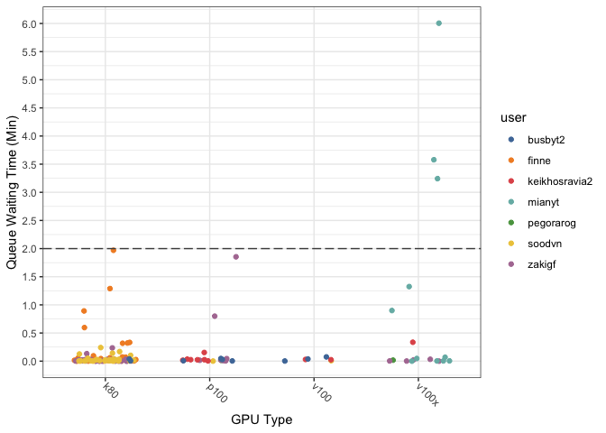

Analysis of Biowulf Waiting Times
================
Gianluca Pegoraro
Aug 13 2021

### Analysis Setup

Load required packages.

``` r
library(tidyverse)
```

    ## ── Attaching packages ─────────────────────────────────────── tidyverse 1.3.1 ──

    ## ✓ ggplot2 3.3.5     ✓ purrr   0.3.4
    ## ✓ tibble  3.1.3     ✓ dplyr   1.0.7
    ## ✓ tidyr   1.1.3     ✓ stringr 1.4.0
    ## ✓ readr   2.0.0     ✓ forcats 0.5.1

    ## ── Conflicts ────────────────────────────────────────── tidyverse_conflicts() ──
    ## x dplyr::filter() masks stats::filter()
    ## x dplyr::lag()    masks stats::lag()

``` r
library(lubridate)
```

    ## 
    ## Attaching package: 'lubridate'

    ## The following objects are masked from 'package:base':
    ## 
    ##     date, intersect, setdiff, union

``` r
library(ggthemes)
```

``` r
knitr::opts_chunk$set(
  fig.path = 'output/',
  message = FALSE,
  warning = FALSE
  )
```

Set the palette and the running theme for ggplot2.

``` r
theme_set(theme_bw())
theme_update(axis.text.x = element_text(
angle = -45,
hjust = 0,
vjust = 0.5
))
```

Read Biowulf logs from Susan Chacko.

``` r
data <- read_tsv("data/hitif_jobs") %>% 
  rename(q_time = queued_time) %>%
  mutate(q_time = na_if(q_time, "-")) %>%
  separate(gres, 
           into = c("gpu_t", "lscratch_t"), 
           sep = ",") %>%
  separate(gpu_t, 
           into = c("gpu_t", "gpu_type", "gpu_n"), 
           sep = ":",
           convert = TRUE) %>%
  separate(lscratch_t, 
           into = c("lscratch_t", "lscratch_g"),
           sep = ":",
           convert = TRUE) %>%
  select(user, partition, submit_time, 
         gpu_type, gpu_n, lscratch_g,
         q_time)

glimpse(data)
```

    ## Rows: 164
    ## Columns: 7
    ## $ user        <chr> "pegorarog", "pegorarog", "finne", "finne", "finne", "finn…
    ## $ partition   <chr> "interactive", "interactive", "interactive", "interactive"…
    ## $ submit_time <dttm> 2021-06-21 12:21:13, 2021-06-21 12:23:39, 2021-03-22 14:3…
    ## $ gpu_type    <chr> "p100", "v100x", "k80", "k80", "k80", "k80", "k80", "k80",…
    ## $ gpu_n       <int> 1, 1, 4, 4, 4, 4, 4, 4, 4, 4, 4, 4, 4, 4, 4, 4, 4, 4, 4, 4…
    ## $ lscratch_g  <int> 400, 500, 700, 700, 700, 700, 700, 700, 700, 700, 700, 700…
    ## $ q_time      <chr> "0:53", "1:04", "4:26", "53:31", "1:17:22", "0:13", "0:01"…

Tidy up waiting time format.

``` r
q_time <- data %>% pull(q_time)

q_time_trans <- q_time %>% 
  str_replace("^(\\d:\\d{2})", "0\\1") %>% 
  str_replace("^(\\d{2}:\\d{2})$", "00:\\1") %>%
  str_replace("^(\\d{2}:\\d{2}:\\d{2})", "1970-01-01 \\1") %>%
  str_replace("^\\d-(\\d{2}:\\d{2}:\\d{2})", "1970-01-02 \\1") %>% 
  ymd_hms()

(q_secs <- as.integer(q_time_trans - origin))
```

    ##   [1]     53     64    266   3211   4642     13      1   7092   1161   1144
    ##  [11]     NA     12     99    251    162     61      5    217     70     87
    ##  [21]      8     66     54   1199   2147     74     16     34     86     62
    ##  [31]     82     51    157    341    194     NA     NA     NA     NA     NA
    ##  [41]     76     30      4   2878     49     28     36     97     79     33
    ##  [51]     99    109    479    847      2      2     50      1     NA    115
    ##  [61]     14     10     15     19     36    160     16      3     73    103
    ##  [71]      7      1      4     13     48     13     20      5     15    120
    ##  [81]    140     65      3     79     79     28     11     56   6674     11
    ##  [91]     46      3     31     15     40     41     NA     NA      1     22
    ## [101]    612     14    121     21     43     56     16     10     48      1
    ## [111]     21     33     11    867     98    101     18    133     86     88
    ## [121]    185     80     72    509     24     41     61    369     45    459
    ## [131]     15      1     15    250     13    170   4769  21618  11675  12883
    ## [141]   3238    108     93     93     17     87  37011     56    127    554
    ## [151]  35622   1209     NA 165974     91      9     12     21    138    109
    ## [161]     28    170    270    140

Replace queueing times in the data table.

``` r
queue_durations <- data %>% 
  select(-q_time) %>%
  mutate(q_secs = q_secs)

glimpse(queue_durations)
```

    ## Rows: 164
    ## Columns: 7
    ## $ user        <chr> "pegorarog", "pegorarog", "finne", "finne", "finne", "finn…
    ## $ partition   <chr> "interactive", "interactive", "interactive", "interactive"…
    ## $ submit_time <dttm> 2021-06-21 12:21:13, 2021-06-21 12:23:39, 2021-03-22 14:3…
    ## $ gpu_type    <chr> "p100", "v100x", "k80", "k80", "k80", "k80", "k80", "k80",…
    ## $ gpu_n       <int> 1, 1, 4, 4, 4, 4, 4, 4, 4, 4, 4, 4, 4, 4, 4, 4, 4, 4, 4, 4…
    ## $ lscratch_g  <int> 400, 500, 700, 700, 700, 700, 700, 700, 700, 700, 700, 700…
    ## $ q_secs      <int> 53, 64, 266, 3211, 4642, 13, 1, 7092, 1161, 1144, NA, 12, …

Percentage of requests with no queue time value (incorrect or too fast).

``` r
queue_durations %>% 
  summarise(perc_na = 100*mean(is.na(q_secs))) 
```

    ## # A tibble: 1 × 1
    ##   perc_na
    ##     <dbl>
    ## 1    6.10

Percentage of GPU requests by user.

``` r
tot <- nrow(queue_durations)

queue_durations %>%
  group_by(user) %>%
  summarise(user_perc = 100*(n()/tot)) %>%
  arrange(desc(user_perc))
```

    ## # A tibble: 7 × 2
    ##   user          user_perc
    ##   <chr>             <dbl>
    ## 1 zakigf            30.5 
    ## 2 finne             23.8 
    ## 3 soodvn            23.8 
    ## 4 keikhosravia2      8.54
    ## 5 mianyt             6.71
    ## 6 busbyt2            5.49
    ## 7 pegorarog          1.22

Percentage of GPU requests by GPU type.

``` r
queue_durations %>%
  group_by(gpu_type) %>%
  summarise(gpu_type_perc = 100*(n()/tot)) %>%
  arrange(desc(gpu_type_perc))
```

    ## # A tibble: 4 × 2
    ##   gpu_type gpu_type_perc
    ##   <chr>            <dbl>
    ## 1 k80              67.7 
    ## 2 p100             15.9 
    ## 3 v100x            11.6 
    ## 4 v100              4.88

<!-- -->

<!-- -->

<!-- -->

<!-- -->

Percentage of requests with a waiting time more than a certain
threshold.

``` r
queue_durations %>%
  filter(!is.na(q_secs)) %>%
  group_by(gpu_type) %>%
  summarise(n = n(),
            perc_long_1hrs = 100*mean(q_secs >= 3600),
            perc_long_2hrs = 100*mean(q_secs >= 7200),
            perc_long_3hrs = 100*mean(q_secs >= 10800))
```

    ## # A tibble: 4 × 5
    ##   gpu_type     n perc_long_1hrs perc_long_2hrs perc_long_3hrs
    ##   <chr>    <int>          <dbl>          <dbl>          <dbl>
    ## 1 k80        107           1.87           0              0   
    ## 2 p100        21           9.52           4.76           4.76
    ## 3 v100         7          14.3           14.3           14.3 
    ## 4 v100x       19          26.3           21.1           21.1
